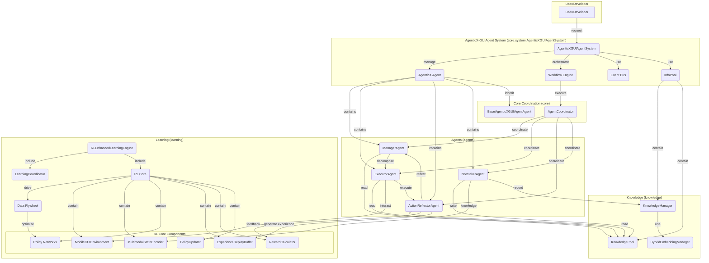

# AgenticX-GUIAgent: Autonomous Mobile GUI Agent System on AgenticX

[English] | [中文版本](README_zn.md)

AgenticX-GUIAgent is a multi-agent system built on `agenticx` (v0.2.1). It automates complex Android GUI operations from natural language instructions, integrating multimodal reasoning, knowledge management, and learning for continuous improvement.

## Key Features

- **Multi-agent collaboration**: Manager, Executor, Reflector, Notetaker work together.
- **Knowledge-driven**: A shared knowledge pool improves success rates over time.
- **Learning loop**: A data flywheel enables continuous optimization.
- **Multimodal understanding**: Reasoning over screenshots and UI context.
- **Extensible**: Easy to add agents, tools, and capabilities.

## Architecture

The system is layered and modular. Core components are:



## Directory Structure

> This section covers the root files and key subdirectories under `AgenticX-GUIAgent/`.

### Root Files

- `.gitignore`: Git ignore rules.
- `LICENSE`: License.
- `README.md`: Project documentation (this file).
- `README_zn.md`: Chinese documentation.
- `requirements.txt`: Python dependencies.
- `setup.sh`: Automated environment setup script.
- `config.yaml`: Default runtime configuration (LLM, knowledge, learning, evaluation).
- `config.py`: Configuration data models and validation.
- `main.py`: System entry point (initialization, execution, interactive mode).
- `utils.py`: Common utilities (logging, config loading, retry, JSON).
- `check_adb.py`: ADB diagnostics for device connectivity.
- `cli_knowledge_manager.py`: Knowledge base CLI (status/query/export).

### Key Directories

- `agents/`: Core agent implementations (Manager/Executor/Reflector/Notetaker).
- `core/`: Core components (base agent, InfoPool, context, coordinator).
- `tools/`: GUI tools and executor (ADB/basic/smart tools).
- `knowledge/`: Knowledge management (storage, retrieval, embeddings).
- `learning/`: Learning engine (five-stage learning + RL core).
- `evaluation/`: Evaluation framework (metrics, benchmarks, reports).
- `workflows/`: Multi-agent collaboration workflow orchestration.
- `docker/`: Docker/Compose configs and optional services.
- `tests/`: Test cases and test resources.

## Requirements

### Hardware
- CPU: 4+ cores
- Memory: 8GB+ (16GB recommended)
- Storage: 10GB free
- Android device: Android 8.0+ with ADB debugging enabled

### Software
- Python 3.9+
- Conda (Anaconda/Miniconda)
- ADB (Android Debug Bridge)
- Git

## Setup

We provide both automated and manual setup.

### 1. Automated Setup (Recommended)

Run `setup.sh` to prepare the environment and dependencies:

```bash
bash setup.sh
```

This script will:
- Check Conda, ADB, Python.
- Create `agenticx-guiagent` conda env.
- Install dependencies and AgenticX (editable).
- Create a `run.sh` launcher.
- Attempt to create `.env` from `.env.example` if it exists (otherwise create `.env` manually).

### 2. Manual Setup

If you prefer manual setup, follow the steps below.

#### Step 1: Create environment

```bash
conda create -n agenticx-guiagent python=3.9 -y
conda activate agenticx-guiagent
```

#### Step 2: Install dependencies

```bash
pip install --upgrade pip
pip install -r requirements.txt

# Install AgenticX (editable)
# cd /path/to/AgenticX
# pip install -e .

# Optional mobile control tools
pip install adbutils pure-python-adb
```

#### Step 3: Configure environment variables

Create a `.env` file (or use your own environment variable manager). The default `config.yaml` uses Bailian; adjust as needed.

```bash
nano .env
```

Example `.env`:
```
# Bailian (default in config.yaml)
BAILIAN_API_KEY=your_bailian_api_key
BAILIAN_CHAT_MODEL=qwen-vl-max
BAILIAN_API_BASE=https://dashscope.aliyuncs.com/compatible-mode/v1
BAILIAN_EMBEDDING_MODEL=text-embedding-v4

# Optional app settings
DEBUG=true
LOG_LEVEL=INFO
```

#### Step 4: Prepare Android device and ADB

1. **Enable Developer Options**:
    - Settings → About phone → tap "Build number" 7 times
2. **Enable USB debugging**:
    - Settings → Developer options → USB debugging
    - Settings → Developer options → USB installation
3. **Connect device**:
    - Connect via USB
    - Authorize USB debugging on device
4. **Verify ADB**:
    ```bash
    adb version
    adb start-server
    adb devices
    ```

## Run

### 1. Start AgenticX-GUIAgent

Make sure your Android device is connected.

* **Interactive mode**:
    ```bash
    ./run.sh --interactive
    # or
    python main.py --interactive
    ```

* **Single-task mode**:
    ```bash
    ./run.sh --task "Open WeChat and send a message to Alice"
    # or
    python main.py --task "Open WeChat and send a message to Alice"
    ```

### 2. Other options

```bash
# Enable evaluation
python main.py --task "Open Settings" --evaluate

# Use custom config
python main.py --config custom_config.yaml

# Set log level
python main.py --log-level DEBUG
```

## Examples

### Example 1: Send a WeChat message

```
"Send a WeChat message to Jennifer: I will be home for dinner tonight."
```
**Typical flow**:
1. **Manager** decomposes the task
2. **Executor** performs GUI actions
3. **ActionReflector** validates results
4. **Notetaker** records knowledge

### Example 2: Set an alarm

```
"Set an alarm for 8:00 AM tomorrow with note: meeting"
```
**Typical flow**: Open Clock → Create alarm → Set time → Add note → Save

### Example 3: Multi-step app task

```
"Open TikTok, search for food videos, like the top 3."
```
**Typical flow**: Launch app → Search → Browse results → Like top 3

## Docker Deployment

We provide Docker and Docker Compose configs for containerized environments.

1. **Enter the `docker` directory**:
    ```bash
    cd docker
    ```
2. **Configure environment variables**:
    ```bash
    cp env.example .env
    nano .env
    ```
3. **Start services**:
    ```bash
    docker-compose up --build
    ```
    **Note**: For USB access, you may need `--privileged -v /dev/bus/usb:/dev/bus/usb`.

See `docker/README.md` for details.

## Troubleshooting

### Common issues

1. **ADB connection fails**:
    ```bash
    adb kill-server
    adb start-server
    adb devices
    ```
2. **Dependency install fails**:
    ```bash
    conda activate agenticx-guiagent
    pip install --upgrade pip
    pip cache purge
    pip install -r requirements.txt --force-reinstall
    ```
3. **LLM API failures**:
    - Check API keys in `.env`.
    - Ensure network access.
    - Verify account quota.
4. **Device actions fail**:
    - Ensure device is unlocked.
    - Ensure target app is installed.
    - Ensure USB debugging is enabled.

### Logs

```bash
python main.py --log-level DEBUG

# Tail file logs if configured:
# tail -f logs/agenticx-guiagent.log
```

## Development & Testing

* **Run tests**:
    ```bash
    pytest
    ```
* **Code style**:
    ```bash
    pre-commit install
    pre-commit run --all-files
    ```

## Support & Feedback

- Repo: `https://github.com/DemonDamon/AgenticX-GUIAgent` (replace with actual)
- Issues: open a GitHub issue

---

**Note**: Make sure environment variables and device connections are configured before running. Start with a simple task first.
