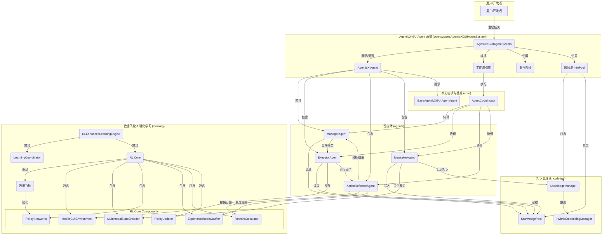

# AgenticX-GUIAgent: 基于 AgenticX 的自主移动GUI智能体系统

AgenticX-GUIAgent 是一个先进的多智能体系统，构建于 `agenticx` (v0.2.1) 框架之上。它旨在通过自然语言指令，实现对Android设备GUI的复杂操作自动化。系统集成了强大的多模态能力、知识管理和强化学习机制，使其能够持续学习并优化其行为。

## 核心特性

*   **多智能体协作**: 由指挥官、执行者、反思者、记录员等多个智能体协同工作，完成复杂任务。
*   **知识驱动**: 内置知识池，能够沉淀和复用操作经验，提高任务成功率。
*   **强化学习**: 创新的数据飞轮机制，通过与环境的持续交互进行自我进化和策略优化。
*   **多模态理解**: 能够理解屏幕截图、UI布局等多模态信息，做出精准决策。
*   **高度可扩展**: 基于 AgenticX 框架，易于扩展新的智能体、工具和能力。

## 技术架构

系统采用分层、模块化的设计，核心组件包括：



## 系统要求

### 硬件要求
- CPU: 4核心以上
- 内存: 8GB以上（推荐16GB）
- 存储: 10GB可用空间
- Android设备: 支持ADB调试的Android 8.0+设备

### 软件要求
- Python 3.9+
- Conda (Anaconda/Miniconda)
- ADB (Android Debug Bridge)
- Git

## 环境准备与安装

我们提供了一键式安装脚本和手动安装两种方式。

### 1. 自动安装 (推荐)

直接运行项目根目录下的 `setup.sh` 脚本即可自动完成所有环境准备、依赖安装和配置工作。

```bash
bash setup.sh
```

该脚本会执行以下操作：
*   检查 Conda, ADB, Python 环境。
*   创建名为 `agenticx-guiagent` 的 Conda 环境。
*   激活环境并安装所有依赖。
*   在开发模式下安装 `agenticx` 框架。
*   从 `.env.example` 创建 `.env` 配置文件。
*   创建 `run.sh` 启动脚本。

### 2. 手动安装

如果您希望手动进行安装，请遵循以下步骤：

#### 第一步：克隆项目并创建环境

```bash
# 假定您已克隆仓库
# git clone <repository_url>
# cd AgenticX-GUIAgent

# 创建并激活 Conda 环境
conda create -n agenticx-guiagent python=3.9 -y
conda activate agenticx-guiagent
```

#### 第二步：安装依赖

```bash
# 更新 pip 并安装依赖
pip install --upgrade pip
pip install -r requirements.txt

# 安装 AgenticX 框架 (如果尚未在其他地方安装)
# cd /path/to/AgenticX
# pip install -e .

# 安装额外的移动设备控制工具
pip install adbutils pure-python-adb
```

#### 第三步：配置环境变量

复制环境变量模板文件，并根据您的实际情况填写 `LLM_PROVIDER` 和对应的 `API_KEY`。

```bash
cp .env.example .env
nano .env  # 或者使用您喜欢的编辑器
```

`.env` 文件内容示例:
```
# LLM配置（选择一个提供商）
LLM_PROVIDER=openai
OPENAI_API_KEY=your_openai_api_key_here
OPENAI_CHAT_MODEL=gpt-4o-mini

# 或者使用其他提供商
# LLM_PROVIDER=deepseek
# DEEPSEEK_API_KEY=your_deepseek_api_key_here

# 应用配置
DEBUG=true
LOG_LEVEL=INFO
```

#### 第四步：配置Android设备与ADB

1.  **启用开发者选项**:
    *   设置 → 关于手机 → 连续点击"版本号"7次

2.  **启用USB调试**:
    *   设置 → 开发者选项 → USB调试（开启）
    *   设置 → 开发者选项 → USB安装（开启）

3.  **连接设备**:
    *   使用USB线连接设备到电脑
    *   在设备上授权USB调试

4.  **验证ADB连接**:
    ```bash
    # 检查ADB版本
    adb version

    # 启动ADB服务
    adb start-server

    # 检查连接的设备
    adb devices
    # 确保设备显示为"device"状态
    ```

## 运行系统

### 1. 启动 AgenticX-GUIAgent

确保您的Android设备已成功连接。

*   **交互模式**: 在此模式下，您可以与系统进行多轮对话，动态下达指令。
    ```bash
    # 使用自动生成的脚本
    ./run.sh --interactive
    
    # 或者手动执行
    python main.py --interactive
    ```

*   **单任务模式**: 直接指定一个任务，系统执行完毕后会自动退出。
    ```bash
    # 使用自动生成的脚本
    ./run.sh --task "在设置中将语言切换为英文"

    # 或者手动执行
    python main.py --task "帮我发微信给jennifer，说我今晚回家吃饭"
    ```

### 2. 其他运行参数

```bash
# 从文件读取任务
python main.py --task-file tasks.txt

# 启用性能评估
python main.py --task "打开设置" --evaluate

# 使用自定义配置文件
python main.py --config custom_config.yaml

# 设置日志级别
python main.py --log-level DEBUG
```

## 使用示例

### 示例1: 发送微信消息

```
"帮我发微信给jennifer，说我今晚回家吃饭"
```
**系统执行流程**:
1.  **Manager**分析任务：打开微信 → 找到联系人 → 发送消息
2.  **Executor**执行操作：点击微信图标 → 搜索jennifer → 输入消息 → 发送
3.  **ActionReflector**验证：确认消息发送成功
4.  **Notetaker**记录：保存操作经验和知识

### 示例2: 设置闹钟

```
"设置明天早上8点的闹钟，备注是开会"
```
**执行流程**:
1.  打开时钟应用
2.  创建新闹钟
3.  设置时间为8:00
4.  添加备注"开会"
5.  保存闹钟

### 示例3: 复杂应用操作

```
"打开抖音，搜索美食相关视频，点赞前3个视频"
```
**执行流程**:
1.  启动抖音应用
2.  点击搜索按钮
3.  输入"美食"关键词
4.  浏览搜索结果
5.  依次点赞前3个视频

## Docker 部署

对于需要容器化部署的场景，我们提供了完整的 Docker 和 Docker Compose 配置。

1.  **进入 `docker` 目录**:
    ```bash
    cd docker
    ```

2.  **配置环境变量**:
    复制并编辑 `env.example` 文件为 `.env`，填入数据库、API密钥等信息。
    ```bash
    cp env.example .env
    nano .env
    ```

3.  **启动服务**:
    使用 Docker Compose 一键启动所有服务，包括 AgenticX-GUIAgent 应用、PostgreSQL 数据库、Redis 缓存等。
    ```bash
    docker-compose up --build
    ```
    **注意**: 可能需要配置USB设备访问权限，例如在 `docker run` 时添加 `--privileged -v /dev/bus/usb:/dev/bus/usb`。

更多详细信息，请参考 `docker/README.md`。

## 故障排除

### 常见问题

1.  **ADB连接失败**:
    ```bash
    # 重启ADB服务
    adb kill-server
    adb start-server
   
    # 检查设备授权
    adb devices
    ```

2.  **依赖安装失败**:
    ```bash
    # 确保在正确的conda环境中
    conda activate agenticx-guiagent
    
    # 更新pip并清理缓存
    pip install --upgrade pip
    pip cache purge
   
    # 重新安装
    pip install -r requirements.txt --force-reinstall
    ```

3.  **LLM API调用失败**:
    *   检查 `.env` 文件中的API密钥是否正确。
    *   验证网络连接是否可以访问API服务。
    *   确认API账户有足够配额。

4.  **设备操作失败**:
    *   确认设备屏幕已解锁。
    *   检查目标应用是否已安装。
    *   验证开发者选项中的 "USB调试" 和 "USB安装" 是否开启。

### 日志调试

```bash
# 启用详细日志运行
python main.py --log-level DEBUG

# 查看日志文件 (如果配置了文件日志)
# tail -f logs/agenticx-guiagent.log
```

## 性能优化

1.  **内存优化**: 调整批处理大小、启用模型缓存、定期清理历史数据。
2.  **速度优化**: 使用本地或更快的LLM模型、启用操作缓存、优化图像处理分辨率。
3.  **准确性优化**: 调整LLM温度参数、增加操作间的验证步骤、完善错误处理逻辑。

## 扩展开发

### 添加新的操作工具

```python
# 在 tools/ 目录下创建新工具文件
from agenticx.tools.base import BaseTool

class CustomTool(BaseTool):
    def _run(self, **kwargs):
        # 实现工具逻辑
        pass
```

### 自定义智能体

```python
# 继承基础智能体类
from core.base_agent import BaseAgenticXGUIAgentAgent

class CustomAgent(BaseAgenticXGUIAgentAgent):
    async def process_task(self, task):
        # 实现自定义逻辑
        pass
```

## 开发与测试

项目内置了丰富的测试用例，以确保代码质量和系统稳定性。

*   **运行测试**:
    ```bash
    # 确保已安装 pytest 相关依赖
    pytest
    ```

*   **代码规范**:
    项目使用 `black`, `isort`, `flake8` 进行代码格式化和静态检查。建议在提交代码前运行 `pre-commit`。
    ```bash
    pre-commit install
    pre-commit run --all-files
    ```

## 支持与反馈

- 项目地址: `https://github.com/DemonDamon/AgenticX-GUIAgent` (请替换为实际地址)
- 问题反馈: 在 GitHub 上创建 Issue

---

**注意**: 请确保在使用前已正确配置所有环境变量和设备连接。首次运行建议使用简单任务进行测试。