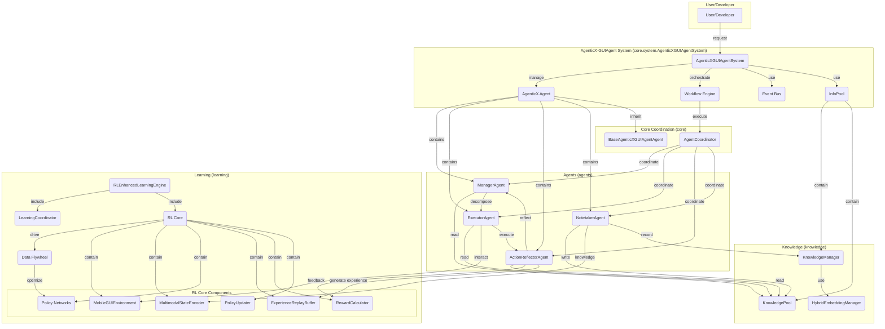

# AgenticX-GUIAgent：基于 AgenticX 的自主移动 GUI 智能体系统

[中文] | [English](README.md)

AgenticX-GUIAgent 是一个多智能体系统，构建于 `agenticx` (v0.2.1) 框架之上。它通过自然语言指令自动化复杂的 Android GUI 操作，结合多模态推理、知识管理与学习机制，持续优化执行效果。

## 核心特性

- **多智能体协作**：Manager / Executor / Reflector / Notetaker 协同完成任务。
- **知识驱动**：共享知识池沉淀经验，提高成功率。
- **学习闭环**：数据飞轮机制实现持续优化。
- **多模态理解**：结合截图与 UI 上下文做出决策。
- **易扩展**：便于新增智能体、工具和能力。

## 技术架构

系统采用分层、模块化设计，核心组件如下：



## 目录结构

> 本节仅覆盖 `AgenticX-GUIAgent/` 根目录文件与关键子目录。

### 根目录

- `.gitignore`：Git 忽略规则。
- `LICENSE`：开源协议。
- `README.md`：英文版文档。
- `README_zn.md`：中文版文档（本文件）。
- `requirements.txt`：Python 依赖列表。
- `setup.sh`：自动化环境搭建脚本。
- `config.yaml`：默认运行配置（LLM、知识库、学习、评估）。
- `config.py`：配置数据模型与校验。
- `main.py`：系统入口（初始化、执行、交互模式）。
- `utils.py`：通用工具函数（日志、配置加载、重试、JSON）。
- `check_adb.py`：ADB 设备诊断脚本。
- `cli_knowledge_manager.py`：知识库 CLI（查询/导出/状态）。

### 关键子目录

- `agents/`：核心智能体实现（Manager/Executor/Reflector/Notetaker）。
- `core/`：核心组件（基类、InfoPool、上下文、协调器等）。
- `tools/`：GUI 操作工具与执行器（ADB/基础/智能工具）。
- `knowledge/`：知识管理（存储、检索、嵌入）。
- `learning/`：学习引擎（五阶段学习 + RL Core）。
- `evaluation/`：评估框架（指标、基准、报告）。
- `workflows/`：协作工作流编排。
- `docker/`：Docker/Compose 配置。
- `tests/`：测试用例与资源。

## 运行要求

### 硬件
- CPU：4 核以上
- 内存：8GB 以上（推荐 16GB）
- 存储：10GB 可用空间
- Android 设备：Android 8.0+ 且开启 ADB 调试

### 软件
- Python 3.9+
- Conda (Anaconda/Miniconda)
- ADB (Android Debug Bridge)
- Git

## 安装与环境准备

### 1. 自动安装（推荐）

运行 `setup.sh` 进行环境准备：

```bash
bash setup.sh
```

脚本将执行：
- 检查 Conda / ADB / Python。
- 创建 `agenticx-guiagent` 环境。
- 安装依赖与 AgenticX（editable）。
- 生成 `run.sh` 启动脚本。
- 如果存在 `.env.example` 则创建 `.env`，否则需要手动创建。

### 2. 手动安装

#### 步骤 1：创建环境

```bash
conda create -n agenticx-guiagent python=3.9 -y
conda activate agenticx-guiagent
```

#### 步骤 2：安装依赖

```bash
pip install --upgrade pip
pip install -r requirements.txt

# 安装 AgenticX（开发模式）
# cd /path/to/AgenticX
# pip install -e .

# 可选：移动设备控制库
pip install adbutils pure-python-adb
```

#### 步骤 3：配置环境变量

创建 `.env`（或自行管理环境变量）。默认 `config.yaml` 使用百炼：

```bash
nano .env
```

示例：
```
BAILIAN_API_KEY=your_bailian_api_key
BAILIAN_CHAT_MODEL=qwen-vl-max
BAILIAN_API_BASE=https://dashscope.aliyuncs.com/compatible-mode/v1
BAILIAN_EMBEDDING_MODEL=text-embedding-v4

DEBUG=true
LOG_LEVEL=INFO
```

#### 步骤 4：配置 ADB

1. 开启开发者选项（设置 → 关于手机 → 连点版本号 7 次）
2. 开启 USB 调试
3. 连接设备并授权
4. 验证 ADB：
   ```bash
   adb version
   adb start-server
   adb devices
   ```

## 运行

### 交互模式

```bash
./run.sh --interactive
# 或
python main.py --interactive
```

### 单任务模式

```bash
./run.sh --task "Open WeChat and send a message to Alice"
# 或
python main.py --task "Open WeChat and send a message to Alice"
```

### 其他参数

```bash
python main.py --task "Open Settings" --evaluate
python main.py --config custom_config.yaml
python main.py --log-level DEBUG
```

## 示例

### 示例 1：发送微信消息

```
"Send a WeChat message to Jennifer: I will be home for dinner tonight."
```

### 示例 2：设置闹钟

```
"Set an alarm for 8:00 AM tomorrow with note: meeting"
```

### 示例 3：多步骤任务

```
"Open TikTok, search for food videos, like the top 3."
```

## Docker 部署

```bash
cd docker
cp env.example .env
nano .env
docker-compose up --build
```

如需 USB 访问，可在 `docker run` 添加：
`--privileged -v /dev/bus/usb:/dev/bus/usb`

更多信息见 `docker/README.md`。

## 故障排除

```bash
adb kill-server
adb start-server
adb devices
```

如需更详细日志：

```bash
python main.py --log-level DEBUG
# tail -f logs/agenticx-guiagent.log
```

## 开发与测试

```bash
pytest
pre-commit install
pre-commit run --all-files
```

## 支持与反馈

- Repo: `https://github.com/DemonDamon/AgenticX-GUIAgent` (replace with actual)
- Issues: open a GitHub issue

---

**注意**：运行前请确保环境变量与设备连接配置完成，建议先从简单任务开始测试。