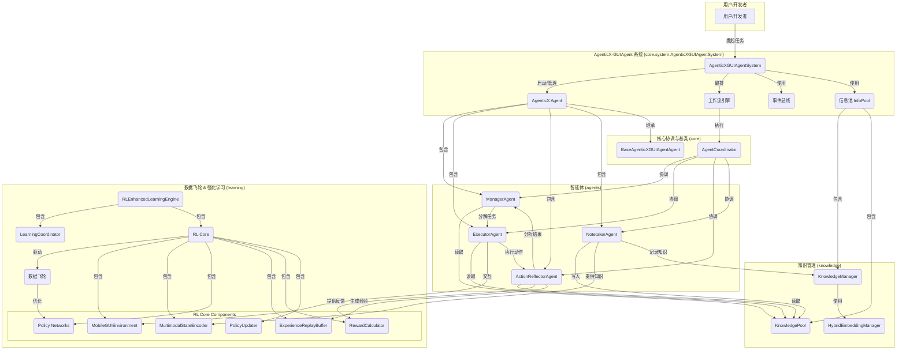

```mermaid
graph TD
    subgraph "用户/开发者"
        A[用户/开发者]
    end

    subgraph "AgenticX-GUIAgent 系统 (core.system.AgenticXGUIAgentSystem)"
        B(AgenticXGUIAgentSystem)
        C(AgenticX Agent)
        D(工作流引擎)
        E(事件总线)
        F(信息池 InfoPool)

        B -- "启动/管理" --> C
        B -- "编排" --> D
        B -- "使用" --> E
        B -- "使用" --> F
    end

    subgraph "智能体 (agents)"
        G(ManagerAgent)
        H(ExecutorAgent)
        I(ActionReflectorAgent)
        J(NotetakerAgent)

        C -- "包含" --> G
        C -- "包含" --> H
        C -- "包含" --> I
        C -- "包含" --> J
    end

    subgraph "核心协调与基类 (core)"
        K(AgentCoordinator)
        L(BaseAgenticXGUIAgentAgent)

        D -- "执行" --> K
        K -- "协调" --> G
        K -- "协调" --> H
        K -- "协调" --> I
        K -- "协调" --> J
        C -- "继承" --> L
    end

    subgraph "知识管理 (knowledge)"
        M(KnowledgeManager)
        N(KnowledgePool)
        O(HybridEmbeddingManager)

        F -- "包含" --> M
        F -- "包含" --> N
        M -- "使用" --> O
        J -- "写入" --> N
        G -- "读取" --> N
        H -- "读取" --> N
        I -- "读取" --> N
    end

    subgraph "数据飞轮 & 强化学习 (learning)"
        P(RLEnhancedLearningEngine)
        Q(LearningCoordinator)
        R(RL Core)
        S(数据飞轮)

        P -- "包含" --> Q
        P -- "包含" --> R
        R -- "驱动" --> S

        subgraph "RL Core Components"
            R1(MobileGUIEnvironment)
            R2(MultimodalStateEncoder)
            R3(Policy Networks)
            R4(ExperienceReplayBuffer)
            R5(RewardCalculator)
            R6(PolicyUpdater)
        end

        R -- "包含" --> R1
        R -- "包含" --> R2
        R -- "包含" --> R3
        R -- "包含" --> R4
        R -- "包含" --> R5
        R -- "包含" --> R6

        H -- "交互" --> R1
        I -- "提供反馈" --> R5
        J -- "提供知识" --> R2
        S -- "优化" --> R3
    end

    A -- "发起任务" --> B
    G -- "分解任务" --> H
    H -- "执行动作" --> I
    I -- "分析结果" --> G
    I -- "生成经验" --> R4
    J -- "记录知识" --> M
```