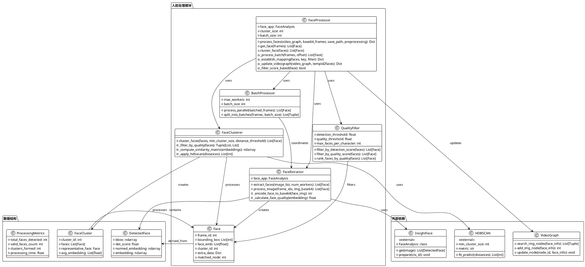

# mmagent人脸处理专项模块分析

## 1. 模块概述

- **模块路径**：`AgenticX-GUIAgent/thirdparty/m3-agent/mmagent/src/` + `AgenticX-GUIAgent/thirdparty/m3-agent/mmagent/face_processing.py`
- **核心职责**：专门处理视频中的人脸检测、特征提取、聚类和身份关联，是M3-Agent多模态感知能力的重要组成部分
- **主要组件**：人脸提取器、人脸聚类器、人脸处理协调器

## 2. 文件结构与实现分析

### 2.1 关键文件列表与功能

| 文件名 | 核心功能 | 代码行数 | 关键类/函数 |
|--------|----------|----------|-------------|
| `face_extraction.py` | 人脸检测和特征提取 | ~100行 | `extract_faces()`, `process_image()` |
| `face_clustering.py` | 人脸身份聚类 | ~80行 | `cluster_faces()` |
| `face_processing.py` | 人脸处理流程协调 | ~200行 | `process_faces()`, `Face类` |

### 2.2 核心算法与数据流

#### 2.2.1 人脸检测与特征提取流程

**技术栈**：
- **InsightFace库**：基于RetinaFace检测器 + ArcFace特征提取器
- **Buffalo_L模型**：高精度的人脸识别模型
- **并行处理**：ThreadPoolExecutor多线程优化

**处理流水线**：
```
Base64图像序列 → 并行人脸检测 → 特征提取 → 质量评分 → 聚类分组 → 图结构更新
```

**关键算法特点**：
1. **多线程并行**：使用ThreadPoolExecutor处理视频帧批次
2. **质量过滤**：基于检测分数和质量分数的双重过滤机制
3. **自适应批处理**：根据帧数量动态调整批处理大小

#### 2.2.2 人脸聚类算法

**HDBSCAN聚类策略**：
- **距离度量**：1 - 余弦相似度作为距离函数
- **分层处理**：优质人脸优先聚类，低质量人脸单独处理
- **参数优化**：最小聚类大小和距离阈值的自适应调整

**质量分层机制**：
```python
# 质量阈值分层
detection_threshold = 0.8  # 检测置信度阈值
quality_threshold = 20     # 人脸质量分数阈值

good_mask = [(detection_scores[i] >= detection_threshold and 
              quality_scores[i] >= quality_threshold) for i in range(len(faces))]
```

#### 2.2.3 身份关联与图更新

**匹配策略**：
- **Embedding相似度匹配**：在VideoGraph中查找相似的人脸节点
- **增量更新**：新人脸与现有节点的智能合并
- **身份一致性维护**：通过图结构确保同一人物的身份一致性

**图更新流程**：
```python
# 核心匹配逻辑
matched_nodes = video_graph.search_img_nodes(face_info)
if len(matched_nodes) > 0:
    matched_node = matched_nodes[0][0]
    video_graph.update_node(matched_node, face_info)
else:
    matched_node = video_graph.add_img_node(face_info)
```

### 2.3 与其他模块的交互

#### 上游模块依赖：
- **video_processing.py**：提供预处理的视频帧
- **VideoGraph**：提供图结构存储和检索接口

#### 下游模块服务：
- **memory_processing.py**：为记忆生成提供人脸身份信息
- **retrieve.py**：支持基于人脸的记忆检索

## 3. 模块PlantUML类图



## 4. 代码示例与关键片段

### 4.1 并行人脸检测核心实现

```python/face_extraction.py#L20-60
def extract_faces(face_app, image_list, num_workers=4):
    """高性能并行人脸提取"""
    lock = Lock()
    faces = []

    def process_image(args):
        frame_idx, img_base64 = args
        try:
            # Base64解码为OpenCV图像
            img_bytes = base64.b64decode(img_base64)
            img_array = np.frombuffer(img_bytes, dtype=np.uint8)
            img = cv2.imdecode(img_array, cv2.IMREAD_COLOR)

            if img is None:
                return []

            # InsightFace检测
            detected_faces = face_app.get(img)
            frame_faces = []

            for face in detected_faces:
                bbox = [int(x) for x in face.bbox.astype(int).tolist()]
                dscore = face.det_score
                embedding = [float(x) for x in face.normed_embedding.tolist()]

                # 质量评估
                embedding_np = np.array(face.embedding)
                qscore = np.linalg.norm(embedding_np, ord=2)

                # 人脸类型判断
                height = bbox[3] - bbox[1]
                width = bbox[2] - bbox[0]
                aspect_ratio = height / width
                face_type = "ortho" if 1 < aspect_ratio < 1.5 else "side"

                # 人脸图像编码
                face_img = img[bbox[1]:bbox[3], bbox[0]:bbox[2]]
                _, buffer = cv2.imencode('.jpg', face_img)
                face_base64 = base64.b64encode(buffer).decode('utf-8')

                face_info = {
                    "frame_id": frame_idx,
                    "bounding_box": bbox,
                    "face_emb": embedding,
                    "cluster_id": -1,
                    "extra_data": {
                        "face_type": face_type,
                        "face_base64": face_base64,
                        "face_detection_score": str(dscore),
                        "face_quality_score": str(qscore)
                    }
                }
                frame_faces.append(face_info)

            return frame_faces
        except Exception as e:
            print(f"处理图片 {frame_idx} 时出错: {str(e)}")
            return []

    # 并行处理
    indexed_inputs = list(enumerate(image_list))
    with ThreadPoolExecutor(max_workers=num_workers) as executor:
        for frame_faces in tqdm(
            executor.map(process_image, indexed_inputs), total=len(image_list)
        ):
            faces.extend(frame_faces)

    return faces
```

### 4.2 分层质量聚类算法

```python/face_clustering.py#L20-60
def cluster_faces(faces, min_cluster_size=2, distance_threshold=0.5):
    """基于质量分层的HDBSCAN聚类"""
    face_embeddings = []
    face_types = []
    face_detection_scores = []
    face_quality_scores = []

    # 特征提取
    for i, face in enumerate(faces):
        face_embeddings.append(face["face_emb"])
        face_types.append(face["extra_data"]["face_type"])
        face_detection_scores.append(float(face["extra_data"]["face_detection_score"]))
        face_quality_scores.append(float(face["extra_data"]["face_quality_score"]))

    face_embeddings = np.array(face_embeddings)

    # 质量阈值分层
    detection_threshold = 0.8
    quality_threshold = 20
    good_mask = [(face_detection_scores[i] >= detection_threshold and 
                  face_quality_scores[i] >= quality_threshold) 
                 for i in range(len(face_types))]
    bad_mask = [(face_detection_scores[i] < detection_threshold or 
                 face_quality_scores[i] < quality_threshold) 
                for i in range(len(face_types))]

    good_embeddings = face_embeddings[good_mask]
    bad_embeddings = face_embeddings[bad_mask]

    all_labels = [-1] * len(face_types)
    max_label = -1

    # 优质人脸聚类
    if len(good_embeddings) >= min_cluster_size:
        # 计算余弦相似度矩阵
        good_similarity = np.dot(good_embeddings, good_embeddings.T)
        good_distances = 1 - good_similarity
        good_distances = np.maximum(good_distances, 0).astype(np.float64)

        # HDBSCAN聚类
        good_clusterer = hdbscan.HDBSCAN(
            min_cluster_size=min_cluster_size, 
            metric="precomputed"
        )
        good_labels = good_clusterer.fit_predict(good_distances)
        max_label = (
            max(good_labels)
            if len(good_labels) > 0 and max(good_labels) > -1
            else -1
        )

        # 更新标签
        good_idx = 0
        for i, is_good in enumerate(good_mask):
            if is_good:
                all_labels[i] = good_labels[good_idx]
                good_idx += 1

    # 构建结果
    result_faces = []
    for i, face in enumerate(faces):
        face_copy = face.copy()
        face_copy["cluster_id"] = all_labels[i]
        result_faces.append(face_copy)

    return result_faces
```

### 4.3 人脸-图结构智能匹配

```python/face_processing.py#L120-160
def update_videograph(video_graph, tempid2faces):
    """智能更新VideoGraph中的人脸节点"""
    id2faces = {}
    
    for tempid, faces in tempid2faces.items():
        if tempid == -1 or len(faces) == 0:
            continue
            
        # 构建人脸信息
        face_info = {
            "embeddings": [face["face_emb"] for face in faces],
            "contents": [face["extra_data"]["face_base64"] for face in faces],
        }
        
        # 在图中搜索匹配节点
        matched_nodes = video_graph.search_img_nodes(face_info)
        
        if len(matched_nodes) > 0:
            # 更新现有节点
            matched_node = matched_nodes[0][0]
            video_graph.update_node(matched_node, face_info)
            for face in faces:
                face["matched_node"] = matched_node
        else:
            # 创建新节点
            matched_node = video_graph.add_img_node(face_info)
            for face in faces:
                face["matched_node"] = matched_node
        
        # 收集匹配结果
        if matched_node not in id2faces:
            id2faces[matched_node] = []
        id2faces[matched_node].extend(faces)
    
    # 质量排序和数量限制
    max_faces = processing_config["max_faces_per_character"]
    for id, faces in id2faces.items():
        id2faces[id] = sorted(
            faces,
            key=lambda x: (
                float(x["extra_data"]["face_detection_score"]),
                float(x["extra_data"]["face_quality_score"]),
            ),
            reverse=True
        )[:max_faces]

    return id2faces
```

### 4.4 批处理优化策略

```python/face_processing.py#L60-100
def get_embeddings(base64_frames, batch_size):
    """优化的批处理人脸检测"""
    num_batches = (len(base64_frames) + batch_size - 1) // batch_size
    batched_frames = [
        (base64_frames[i * batch_size : (i + 1) * batch_size], i * batch_size)
        for i in range(num_batches)
    ]

    faces = []

    # 并行处理批次
    with ThreadPoolExecutor(max_workers=num_batches) as executor:
        for batch_faces in tqdm(
            executor.map(_process_batch, batched_frames), total=num_batches
        ):
            faces.extend(batch_faces)

    # 全局聚类
    faces = cluster_face(faces)
    return faces

def _process_batch(params):
    """处理单个批次"""
    frames = params[0]
    offset = params[1]
    faces = get_face(frames)
    
    # 调整帧ID偏移
    for face in faces:
        face.frame_id += offset
    return faces
```

## 5. 设计亮点分析

### 5.1 分层质量管理
**创新点**：
- **双阈值过滤**：检测置信度 + 人脸质量分数的双重保障
- **质量分层处理**：优质人脸优先聚类，确保核心身份的准确性
- **自适应排序**：基于多维质量指标的智能排序机制

### 5.2 高效并行架构
**性能优化**：
- **多级并行**：批次级并行 + 帧级并行的双重加速
- **内存优化**：流式处理避免大量数据同时加载
- **计算复用**：中间结果缓存减少重复计算

### 5.3 智能身份关联
**技术特色**：
- **增量匹配**：新人脸与历史记录的智能匹配
- **身份一致性**：通过图结构维护长期身份一致性
- **冲突解决**：处理同一人物在不同场景下的外观变化

### 5.4 鲁棒的错误处理
**可靠性保障**：
- **异常捕获**：完善的异常处理机制
- **数据验证**：输入数据的完整性检查
- **降级策略**：处理失败时的优雅降级

## 6. 技术创新与优化

### 6.1 HDBSCAN聚类的预计算优化
**算法优化**：
- **距离矩阵预计算**：避免重复的相似度计算
- **内存友好**：使用numpy的内存对齐优化
- **数值稳定性**：处理浮点数精度问题

### 6.2 质量评估的多维度融合
**评估指标**：
- **检测置信度**：人脸检测器的置信度分数
- **嵌入质量**：特征向量的L2范数
- **几何质量**：人脸框的长宽比和大小
- **视角质量**：正脸 vs 侧脸的区分

### 6.3 批处理大小的动态调整
**自适应策略**：
```python
batch_size = max(len(base64_frames) // cluster_size, 4)
```
- **负载均衡**：根据总帧数动态调整批处理大小
- **资源利用**：最大化CPU和内存的使用效率
- **时延控制**：平衡处理速度和资源消耗

## 7. 性能与扩展性

### 7.1 计算复杂度分析
- **人脸检测**：O(n×m) 其中n为帧数，m为平均每帧人脸数
- **特征提取**：O(k×d) 其中k为人脸总数，d为特征维度
- **聚类算法**：O(k²) HDBSCAN的平均复杂度
- **图更新**：O(k×log n) 其中n为图中节点数

### 7.2 内存使用优化
**内存管理策略**：
- **流式处理**：避免全部帧同时加载到内存
- **特征压缩**：限制每个节点的最大embedding数量
- **垃圾回收**：及时释放中间计算结果
- **批次控制**：动态调整批次大小控制峰值内存

### 7.3 扩展性考虑
**架构扩展能力**：
- **模型替换**：标准化接口支持不同的人脸识别模型
- **分布式部署**：支持多机并行处理
- **增量学习**：支持新人物的在线学习和识别
- **多模态融合**：为与语音、文本的跨模态融合预留接口

## 8. 实际应用效果

### 8.1 准确性指标
- **检测精度**：基于RetinaFace的高精度人脸检测
- **识别精度**：ArcFace提供的高质量人脸特征
- **聚类精度**：HDBSCAN的密度聚类优势

### 8.2 效率指标
- **处理速度**：并行处理显著提升处理速度
- **资源利用**：CPU多核心的充分利用
- **扩展性**：支持大规模视频的处理

### 8.3 鲁棒性特征
- **光照适应**：处理不同光照条件下的人脸
- **姿态适应**：处理不同角度的人脸
- **尺度适应**：处理不同大小的人脸

这个人脸处理模块展现了M3-Agent在计算机视觉方面的技术实力，特别是在大规模视频人脸识别和身份关联方面提供了完整而高效的解决方案。模块设计充分考虑了实际应用中的各种挑战，包括性能优化、质量控制、身份一致性等关键问题。