# m3_agent主流程模块详细分析

## 1. 模块概述

- **模块路径**：`AgenticSeeker/thirdparty/m3-agent/m3_agent/`
- **核心职责**：M3-Agent系统的主流程编排和控制，负责整个Agent的记忆化和控制两大核心流程
- **主要组件**：控制器、记忆化中间输出处理器、记忆图构建器

## 2. 文件结构与实现分析

### 2.1 关键文件列表与功能

| 文件名 | 核心功能 | 代码行数 | 关键类/函数 |
|--------|----------|----------|-------------|
| `control.py` | 问答控制和推理执行 | ~200行 | `consumer()`, `eval_answer()`, `get_response()` |
| `memorization_intermediate_outputs.py` | 生成中间表示输出 | ~100行 | `process_segment()`, `streaming_process_video()` |
| `memorization_memory_graphs.py` | 构建最终记忆图 | ~120行 | `process_segment()`, `streaming_process_video()` |

### 2.2 核心算法与数据流

#### 2.2.1 控制流程算法 (control.py)

**主要数据流**：
```
用户问题 → 系统提示 → 迭代推理循环 → 记忆检索 → 答案生成 → 评估验证
```

**核心算法特点**：
1. **多轮迭代推理**：使用while循环进行最多`total_round`轮的推理
2. **动作分类机制**：每轮推理输出[Search]或[Answer]动作
3. **记忆检索策略**：根据查询类型（character id相关 vs 普通查询）采用不同的检索策略
4. **批处理优化**：支持批量处理多个问答任务

**关键实现细节**：
```python
# 动作解析的正则表达式
pattern = r"Action: \[(.*)\].*Content: (.*)"

# 迭代推理的核心逻辑
for idx in range(processing_config["total_round"]):
    # 1. 构建输入提示
    # 2. 调用VLLM模型生成响应  
    # 3. 解析动作类型
    # 4. 执行记忆检索或输出答案
```

#### 2.2.2 记忆化中间输出流程 (memorization_intermediate_outputs.py)

**处理流程**：
```
视频片段 → 帧提取 → 人脸处理 → 语音处理 → 中间结果保存
```

**关键特性**：
- **流式处理**：逐个处理30秒的视频片段
- **多模态并行**：同时处理视觉和听觉信息
- **中间结果缓存**：保存处理结果供后续使用

#### 2.2.3 记忆图构建流程 (memorization_memory_graphs.py)

**构建流程**：
```
中间输出 → 记忆生成 → 图结构更新 → 等价关系刷新 → 序列化保存
```

**核心创新**：
- **情景+语义记忆**：同时生成两种类型的记忆
- **图结构组织**：使用VideoGraph管理复杂的实体关系
- **增量更新**：逐片段更新记忆图而非重新构建

### 2.3 与其他模块的交互

#### 外部依赖关系：
- **mmagent.videograph**：提供VideoGraph核心数据结构
- **mmagent.retrieve**：提供记忆检索功能
- **mmagent.face_processing**：人脸识别和处理
- **mmagent.voice_processing**：语音分离和识别
- **mmagent.memory_processing_qwen**：基于Qwen的记忆生成
- **VLLM**：高性能LLM推理引擎
- **OpenAI API**：GPT-4o模型调用

## 3. 模块PlantUML类图

```plantuml
@startuml m3_agent模块类图
!theme plain

package "m3_agent主流程模块" {
    
    class Control {
        -model: LLM
        -tokenizer: AutoTokenizer
        -sampling_params: SamplingParams
        -client: AzureOpenAI
        +main()
        +consumer(data)
        +eval_answer(question, predict, ground_truth)
        +get_response(messages, timeout)
        +get_response_with_retry(messages, timeout)
    }
    
    class MemorizationIntermediate {
        -processing_config: Dict
        -memory_config: Dict
        +streaming_process_video(sample)
        +process_segment(video_graph, base64_video, base64_frames, base64_audio, clip_id, sample)
    }
    
    class MemorizationMemoryGraphs {
        -processing_config: Dict
        -memory_config: Dict
        -preprocessing: List
        +streaming_process_video(video_graph, sample)
        +process_segment(video_graph, base64_video, base64_frames, base64_audio, clip_id, sample, clip_path)
    }
    
    class BatchData {
        +id: str
        +mem_path: str
        +question: str
        +answer: str
        +conversations: List
        +finish: bool
        +currenr_clips: List
        +response: str
        +gpt_eval: bool
    }
    
    class ProcessingWorkflow {
        <<interface>>
        +process_video_clips()
        +extract_multimodal_features()
        +build_memory_graph()
    }
}

package "外部依赖" {
    class VideoGraph {
        +truncate_memory_by_clip()
        +refresh_equivalences()
    }
    
    class SearchEngine {
        +search(mem_node, query, clips, ...)
    }
    
    class FaceProcessing {
        +process_faces()
    }
    
    class VoiceProcessing {
        +process_voices()
    }
    
    class MemoryProcessingQwen {
        +generate_memories()
        +process_memories()
    }
}

' 关系定义
Control --> BatchData: manages
Control --> VideoGraph: loads
Control --> SearchEngine: uses

MemorizationIntermediate --> FaceProcessing: calls
MemorizationIntermediate --> VoiceProcessing: calls
MemorizationIntermediate ..|> ProcessingWorkflow: implements

MemorizationMemoryGraphs --> VideoGraph: creates/updates
MemorizationMemoryGraphs --> FaceProcessing: calls
MemorizationMemoryGraphs --> VoiceProcessing: calls  
MemorizationMemoryGraphs --> MemoryProcessingQwen: calls
MemorizationMemoryGraphs ..|> ProcessingWorkflow: implements

@enduml
```



## 4. 代码示例与关键片段

### 4.1 控制流程的核心推理循环

```python/control.py#L120-140
# 多轮迭代推理的核心实现
for idx in range(processing_config["total_round"]):
    vllm_inputs = []
    for data in batched_data:
        if data["finish"]:
            continue
        data["conversations"][-1]["content"] += instruction
        if idx == processing_config["total_round"] - 1:
            data["conversations"][-1]["content"] += "\n(The Action of this round must be [Answer]. If there is insufficient information, you can make reasonable guesses.)"
        text = tokenizer.apply_chat_template(
            data["conversations"],
            tokenize=True,
            add_generation_prompt=True,
            enable_thinking=True
        )
        vllm_inputs.append({"prompt_token_ids": text})

    outputs = model.generate(
        prompts=vllm_inputs,
        sampling_params=sampling_params,
        use_tqdm=False,
    )
```

### 4.2 记忆检索的智能路由机制

```python/control.py#L60-80
def consumer(data):
    # 解析模型输出的动作类型
    match_result = re.search(pattern, response.split("</think>")[-1], re.DOTALL)
    if match_result:
        action = match_result.group(1)
        content = match_result.group(2)
    
    if action == "Answer":
        data["response"] = content
        data["finish"] = True
    else:
        # 根据查询内容选择不同的检索策略
        if "character id" in content:
            memories, _, _ = search(mem_node, content, [], mem_wise=True, topk=20, before_clip=before_clip)
        else:
            memories, currenr_clips, _ = search(mem_node, content, data["currenr_clips"], threshold=0.5, topk=processing_config["topk"], before_clip=before_clip)
```

### 4.3 流式视频处理架构

```python/memorization_memory_graphs.py#L50-70
def streaming_process_video(video_graph, sample):
    """流式处理视频片段的核心实现"""
    clips = glob.glob(sample["clip_path"] + "/*")
    for clip_path in clips:
        clip_id = int(clip_path.split("/")[-1].split(".")[0])
        base64_video, base64_frames, base64_audio = process_video_clip(clip_path)

        if base64_frames:
            # 处理单个片段
            process_segment(
                video_graph,
                base64_video, 
                base64_frames,
                base64_audio,
                clip_id,
                sample,
                clip_path
            )
    
    # 刷新等价关系并保存记忆图
    video_graph.refresh_equivalences()
    with open(sample["mem_path"], "wb") as f:
        pickle.dump(video_graph, f)
```

## 5. 设计亮点分析

### 5.1 分层处理架构
- **中间输出层**：先生成标准化的中间表示，提高处理效率和复用性
- **记忆图层**：在中间输出基础上构建高级记忆表示
- **控制层**：基于记忆图进行高级推理和决策

### 5.2 流式处理能力  
- **增量式记忆更新**：逐片段处理避免内存溢出
- **实时响应**：支持在线处理长视频流
- **状态持久化**：记忆图可序列化保存和加载

### 5.3 多模态协同处理
- **并行处理**：同时处理视觉、听觉信息
- **特征融合**：在记忆生成阶段融合多模态特征
- **统一表示**：使用图结构统一管理异构信息

### 5.4 高效推理框架
- **批处理优化**：支持批量问答处理
- **缓存机制**：复用中间计算结果
- **动态检索**：根据推理状态动态调整检索策略

## 6. 性能与扩展性考虑

### 6.1 性能优化点
- 使用VLLM进行高性能LLM推理
- 多进程并行处理批量数据
- 中间结果缓存减少重复计算

### 6.2 扩展性设计
- 模块化架构便于替换组件
- 配置文件外置便于参数调优
- 标准化接口便于集成新功能

这个模块体现了M3-Agent系统设计的核心思想：将复杂的多模态Agent任务分解为清晰的处理流水线，每个环节专注于特定功能，通过标准化接口协同工作。