# mmagent核心功能模块详细分析

## 1. 模块概述

- **模块路径**：`AgenticSeeker/thirdparty/m3-agent/mmagent/`
- **核心职责**：M3-Agent系统的核心功能实现，提供多模态记忆处理、检索、图结构管理等关键能力
- **主要组件**：视频图结构、记忆处理器、检索引擎、提示词管理、多模态处理器

## 2. 文件结构与实现分析

### 2.1 关键文件列表与功能

| 文件名 | 核心功能 | 代码行数 | 关键类/函数 |
|--------|----------|----------|-------------|
| `videograph.py` | 视频图核心数据结构 | ~950行 | `VideoGraph`, `Node`, `refresh_equivalences()` |
| `memory_processing.py` | 记忆生成和处理 | ~400行 | `parse_video_caption()`, `generate_video_context()` |
| `memory_processing_qwen.py` | Qwen模型记忆处理 | ~200行 | `generate_memories()`, `process_memories()` |
| `retrieve.py` | 记忆检索引擎 | ~440行 | `search()`, `retrieve_from_videograph()` |
| `prompts.py` | 提示词模板库 | ~300行 | 各类任务的提示词模板 |
| `face_processing.py` | 人脸识别处理 | ~200行 | `process_faces()` |
| `voice_processing.py` | 语音分离识别 | ~180行 | `process_voices()` |

### 2.2 核心算法与数据流

#### 2.2.1 VideoGraph - 核心图结构算法

**数据结构设计**：
- **节点类型**：`img`(人脸)、`voice`(语音)、`episodic`(情景记忆)、`semantic`(语义记忆)
- **边权重**：表示节点间的关联强度
- **等价关系**：使用并查集(Union-Find)管理角色等价性

**关键算法特性**：
```python
# 等价关系刷新算法
def refresh_equivalences(self):
    # 使用并查集管理角色等价性
    parent = {}
    rank = {}
    
    def find(x):  # 路径压缩优化
        if x not in parent:
            parent[x] = x
            return x
        if parent[x] != x:
            parent[x] = find(parent[x])
        return parent[x]
    
    def union(x, y):  # 按秩合并优化
        px, py = find(x), find(y)
        if px == py:
            return
        if rank[px] < rank[py]:
            px, py = py, px
        parent[py] = px
```

**语义节点聚类**：
- 使用DBSCAN聚类算法
- 基于余弦相似度的距离度量
- 自适应阈值调整

#### 2.2.2 记忆处理流水线

**双重记忆架构**：
```
视频输入 → 多模态特征提取 → 情景记忆生成 → 语义记忆抽象 → 图结构更新
```

**情景记忆 vs 语义记忆**：
- **情景记忆**：具体的事件描述，包含时间、地点、人物、动作
- **语义记忆**：抽象的知识和概念，如角色关系、物体属性、场景理解

#### 2.2.3 智能检索算法

**多层次检索策略**：
1. **文本相似度检索**：基于embedding的向量相似度
2. **时间窗口过滤**：支持时间范围限制
3. **节点类型筛选**：可指定检索特定类型的记忆
4. **动态阈值调整**：根据检索质量自适应调整

**检索优化技术**：
- **缓存机制**：避免重复检索相同clips
- **分数融合**：综合多种相似度指标
- **结果去重**：智能过滤冗余信息

### 2.3 与其他模块的交互

#### 内部模块依赖：
- **utils/chat_api.py**：调用外部LLM API
- **utils/video_processing.py**：视频预处理
- **src/face_extraction.py**：人脸特征提取
- **src/face_clustering.py**：人脸聚类

#### 外部系统集成：
- **OpenAI GPT-4o**：语义理解和生成
- **Qwen2.5-Omni**：多模态记忆生成
- **scikit-learn**：聚类和相似度计算
- **PIL/OpenCV**：图像处理

## 3. 模块PlantUML类图

```plantuml
@startuml mmagent核心模块类图
!theme plain

package "mmagent核心模块" {
    
    class VideoGraph {
        -nodes: Dict[int, Node]
        -edges: Dict[tuple, float]
        -text_nodes: List[int]
        -character_mappings: Dict
        -max_img_embeddings: int
        -max_audio_embeddings: int
        +add_img_node(imgs)
        +add_voice_node(voices)
        +add_text_node(content, node_type, clip_id)
        +refresh_equivalences()
        +search_text_nodes(query, topk)
        +get_entity_info(entity_id)
        +truncate_memory_by_clip(clip_id)
    }
    
    class Node {
        +id: int
        +type: str
        +embeddings: List
        +metadata: Dict
    }
    
    class MemoryProcessor {
        +parse_video_caption(video_graph, caption)
        +generate_video_context(base64_video, base64_frames, faces, voices)
        +process_memories(video_graph, memories, clip_id, type)
    }
    
    class QwenMemoryProcessor {
        +generate_memories(frames, faces, voices, clip_path)
        +process_episodic_memory(video_graph, memories, clip_id)
        +process_semantic_memory(video_graph, memories, clip_id)
    }
    
    class RetrievalEngine {
        +search(video_graph, query, current_clips, topk, mode, threshold)
        +retrieve_from_videograph(video_graph, query, topk)
        +translate(video_graph, contents)
        +get_related_nodes(video_graph, node_id)
    }
    
    class FaceProcessor {
        +process_faces(video_graph, base64_frames, save_path, preprocessing)
        +extract_face_embeddings(frame, face_bbox)
        +cluster_faces(embeddings, threshold)
    }
    
    class VoiceProcessor {
        +process_voices(video_graph, base64_audio, base64_video, save_path, preprocessing)
        +perform_speaker_diarization(audio)
        +extract_voice_features(audio_segment)
    }
    
    class PromptsManager {
        +prompt_generate_captions_with_ids: str
        +prompt_audio_segmentation: str
        +prompt_agent_verify_answer_referencing: str
        +prompt_answer_with_retrieval_final: str
    }
    
    class MultimodalEntity {
        +entity_id: str
        +entity_type: str
        +visual_features: List
        +audio_features: List
        +textual_descriptions: List
        +timestamps: List
    }
}

package "数据流处理" {
    class EpisodicMemory {
        +timestamp: float
        +participants: List[str]
        +actions: List[str]
        +location: str
        +description: str
    }
    
    class SemanticMemory {
        +concept: str
        +relationships: Dict
        +attributes: Dict
        +confidence: float
    }
    
    class MemoryGraph {
        +episodic_memories: List[EpisodicMemory]
        +semantic_memories: List[SemanticMemory]
        +entity_graph: VideoGraph
        +time_index: Dict
    }
}

package "外部接口" {
    interface ChatAPI {
        +get_response_with_retry(messages, timeout)
        +parallel_get_embedding(texts)
        +generate_messages(input)
    }
    
    interface VideoProcessing {
        +process_video_clip(clip_path)
        +extract_frames(video, fps)
        +extract_audio(video)
    }
}

' 关系定义
VideoGraph --> Node: contains
VideoGraph --> MultimodalEntity: manages

MemoryProcessor --> VideoGraph: updates
MemoryProcessor --> ChatAPI: uses
MemoryProcessor --> PromptsManager: uses

QwenMemoryProcessor --> VideoGraph: updates
QwenMemoryProcessor --> EpisodicMemory: creates
QwenMemoryProcessor --> SemanticMemory: creates

RetrievalEngine --> VideoGraph: queries
RetrievalEngine --> MemoryGraph: searches

FaceProcessor --> VideoGraph: adds_nodes
FaceProcessor --> VideoProcessing: uses

VoiceProcessor --> VideoGraph: adds_nodes
VoiceProcessor --> VideoProcessing: uses

MemoryGraph --> EpisodicMemory: contains
MemoryGraph --> SemanticMemory: contains
MemoryGraph --> VideoGraph: includes

@enduml
```



## 4. 代码示例与关键片段

### 4.1 VideoGraph核心数据结构

```python/videograph.py#L40-70
class VideoGraph:
    def __init__(self, max_img_embeddings=10, max_audio_embeddings=20, 
                 img_matching_threshold=0.3, audio_matching_threshold=0.6):
        """Initialize a video graph with nodes for faces, voices and text events."""
        self.nodes = {}  # node_id -> node object
        self.edges = {}  # (node_id1, node_id2) -> edge weight
        self.text_nodes = []  # List of text node IDs in insertion order
        
        self.text_nodes_by_clip = {}
        self.event_sequence_by_clip = {}
        
        self.max_img_embeddings = max_img_embeddings
        self.max_audio_embeddings = max_audio_embeddings
        
        self.img_matching_threshold = img_matching_threshold
        self.audio_matching_threshold = audio_matching_threshold
        
        self.next_node_id = 0

    class Node:
        def __init__(self, node_id, node_type):
            self.id = node_id
            self.type = node_type  # 'img', 'voice', 'episodic' or 'semantic'
            self.embeddings = []
            self.metadata = {}
```

### 4.2 智能记忆检索算法

```python/retrieve.py#L237-270
def search(video_graph, query, current_clips, topk=5, mode='max', 
           threshold=0, mem_wise=False, before_clip=None, episodic_only=False):
    """多层次记忆检索的核心实现"""
    top_clips, clip_scores, nodes = retrieve_from_videograph(
        video_graph, query, topk, mode, threshold, before_clip)
    
    if mem_wise:
        # 基于节点的细粒度检索
        new_memories = {}
        top_nodes_num = 0
        for top_node, _ in nodes:
            clip_id = video_graph.nodes[top_node].metadata['timestamp']
            if before_clip is not None and clip_id > before_clip:
                continue
            if clip_id not in new_memories:
                new_memories[clip_id] = []
            new_ = translate(video_graph, video_graph.nodes[top_node].metadata['contents'])
            new_memories[clip_id].extend(new_)
            top_nodes_num += len(new_)
            if top_nodes_num >= topk:
                break
        return new_memories, current_clips, clip_scores
    else:
        # 基于片段的粗粒度检索
        new_clips = [top_clip for top_clip in top_clips if top_clip not in current_clips]
        new_memories = {}
        current_clips.extend(new_clips)
        
        for new_clip in new_clips:
            if new_clip not in video_graph.text_nodes_by_clip:
                new_memories[new_clip] = [f"CLIP_{new_clip} not found in memory bank"]
            else:
                related_nodes = video_graph.text_nodes_by_clip[new_clip]
                new_memories[new_clip] = translate(video_graph, 
                    [video_graph.nodes[node_id].metadata['contents'][0] 
                     for node_id in related_nodes 
                     if (not episodic_only or video_graph.nodes[node_id].type != "semantic")])
```

### 4.3 实体等价关系管理

```python/videograph.py#L417-450
def refresh_equivalences(self):
    """使用并查集算法管理角色等价关系"""
    # Initialize disjoint set data structure
    parent = {}
    rank = {}
    
    def find(x):
        # Find root/representative of set with path compression
        if x not in parent:
            parent[x] = x
            rank[x] = 0
            return x
        if parent[x] != x:
            parent[x] = find(parent[x])  # 路径压缩优化
        return parent[x]
        
    def union(x, y):
        # Union by rank
        px, py = find(x), find(y)
        if px == py:
            return
        if rank[px] < rank[py]:
            px, py = py, px
        parent[py] = px
        if rank[px] == rank[py]:
            rank[px] += 1
    
    # Process equivalences from semantic memory
    for equivalence in equivalences:
        entities = parse_video_caption(self, equivalence)
        if len(entities) >= 2:
            anchor_node = entities[0][1]  
            for entity in entities[1:]:
                union(anchor_node, entity[1])
```

### 4.4 多模态记忆生成流程

```python/memory_processing.py#L50-80
def generate_video_context(base64_video, base64_frames, faces_list, voices_list, faces_input="face_only"):
    """生成多模态视频上下文"""
    face_frames = []
    face_only = []

    # 处理人脸特征
    for char_id, faces in faces_list.items():
        if len(faces) == 0:
            continue
        face = faces[0]
        frame_id = face["frame_id"]
        frame_base64 = base64_frames[frame_id]

        # 在帧中标记人脸位置
        frame_bytes = base64.b64decode(frame_base64)
        frame_img = Image.open(BytesIO(frame_bytes))
        draw = ImageDraw.Draw(frame_img)

        bbox = face["bounding_box"]
        draw.rectangle(
            [(bbox[0], bbox[1]), (bbox[2], bbox[3])], 
            outline=(0, 255, 0), width=4
        )

        # 转换回base64格式
        buffered = BytesIO()
        frame_img.save(buffered, format="JPEG")
        frame_base64 = base64.b64encode(buffered.getvalue()).decode()
        face_frames.append((f"<face_{char_id}>:", frame_base64))
        face_only.append((f"<face_{char_id}>:", face["extra_data"]["face_base64"]))
```

## 5. 设计亮点分析

### 5.1 分层记忆架构
**创新点**：
- **双重记忆系统**：情景记忆捕获具体事件，语义记忆提取抽象概念
- **增量学习**：支持在线更新，无需重新训练整个系统
- **记忆一致性**：通过等价关系管理确保角色身份的一致性

### 5.2 实体中心的图结构
**设计优势**：
- **多模态融合**：统一表示视觉、听觉、文本信息
- **关系建模**：显式表示实体间的复杂关系
- **动态更新**：支持图结构的动态增删改

### 5.3 智能检索机制
**核心特性**：
- **多粒度检索**：支持节点级和片段级检索
- **上下文感知**：考虑时间顺序和空间关系
- **自适应阈值**：根据查询类型动态调整检索策略

### 5.4 可扩展的提示词系统
**模块化设计**：
- **任务特化**：针对不同任务设计专门的提示词
- **多模态适配**：支持文本、图像、音频的联合输入
- **版本控制**：便于提示词的迭代优化

## 6. 技术创新与优化

### 6.1 并查集优化的等价关系管理
- **路径压缩**：减少查找时间复杂度至近似O(1)
- **按秩合并**：保持树的平衡性，提高整体性能
- **动态维护**：支持角色关系的实时更新

### 6.2 DBSCAN聚类的语义节点组织
- **密度聚类**：自动发现语义相似的记忆簇
- **噪声过滤**：排除低质量或无关的记忆节点
- **参数自适应**：根据数据特性调整聚类参数

### 6.3 多层次缓存机制
- **中间结果缓存**：避免重复的特征提取计算
- **检索结果缓存**：提高相似查询的响应速度
- **内存管理**：智能的缓存淘汰策略

## 7. 性能与扩展性

### 7.1 计算复杂度分析
- **图构建**：O(n²) 其中n为节点数量
- **等价关系刷新**：O(nα(n)) 其中α为反阿克曼函数
- **记忆检索**：O(log n + k) 其中k为返回结果数量

### 7.2 内存使用优化
- **流式处理**：避免一次性加载整个视频
- **embedding压缩**：限制每个节点的embedding数量
- **垃圾回收**：及时清理无用的中间结果

### 7.3 扩展性考虑
- **水平扩展**：支持分布式部署和并行处理
- **模态扩展**：易于集成新的模态类型（如触觉、嗅觉）
- **模型替换**：标准化接口便于替换底层模型

这个核心模块展现了M3-Agent在多模态记忆管理方面的技术深度和创新性，特别是在长期记忆的组织、更新和检索方面提供了完整的解决方案。