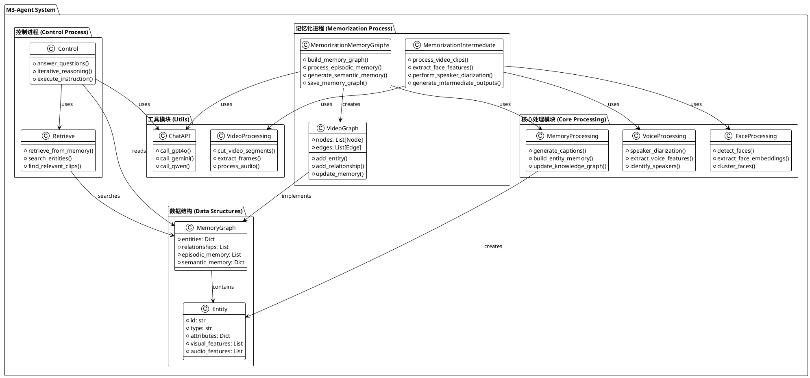

# M3-Agent项目解读报告 - 总览

## 0. 项目概览

### 项目名称与简介
**M3-Agent** - Seeing, Listening, Remembering, and Reasoning: A Multimodal Agent with Long-Term Memory

这是一个由字节跳动开发的创新性多模态Agent框架，具备长期记忆能力。M3-Agent能够像人类一样处理实时的视觉和听觉输入来构建和更新其长期记忆，不仅具备情景记忆，还能发展语义记忆，随时间积累世界知识。

### 核心理念与设计哲学
- **人类化记忆模式**: 模拟人类的认知过程，将记忆分为情景记忆(Episodic Memory)和语义记忆(Semantic Memory)
- **实体中心架构**: 以实体为中心的多模态记忆组织方式，实现对环境更深入、更一致的理解
- **自主推理能力**: 给定指令后，Agent能够自主执行多轮、迭代式推理，从记忆中检索相关信息完成任务
- **长期记忆导向**: 强调长期记忆在Agent系统中的核心作用，而非简单的即时响应

### 技术栈与主要依赖
- **深度学习框架**: PyTorch, Transformers
- **多模态处理**: 
  - 视频处理: FFmpeg, OpenCV相关工具
  - 音频处理: 说话人分离、语音识别
  - 人脸识别: 人脸检测与聚类
- **大语言模型**: 
  - Qwen2.5-Omni (记忆化模型)
  - 自训练的M3-Agent-Control模型
- **API集成**: GPT-4o, Gemini-1.5-pro等商业模型
- **图结构**: 基于图的记忆存储和检索

### 目录结构概览
```
m3-agent/
├── m3_agent/                    # 主流程控制模块
│   ├── control.py              # 控制和推理流程
│   ├── memorization_intermediate_outputs.py  # 中间输出生成
│   └── memorization_memory_graphs.py        # 记忆图构建
├── mmagent/                     # 核心Agent功能模块  
│   ├── src/                    # 人脸处理子模块
│   ├── utils/                  # 工具函数集合
│   ├── face_processing.py      # 人脸识别处理
│   ├── memory_processing.py    # 记忆处理核心
│   ├── memory_processing_qwen.py # Qwen模型记忆处理
│   ├── prompts.py             # 提示词模板
│   ├── retrieve.py            # 记忆检索
│   ├── videograph.py          # 视频图结构
│   └── voice_processing.py    # 语音处理
├── configs/                    # 配置文件
├── data/                       # 数据目录
└── figs/                       # 文档图片
```

## 1. 项目架构设计

### 1.1. 系统整体架构

M3-Agent采用**双进程并行架构**设计：

1. **记忆化进程(Memorization Process)**:
   - 在线处理视频和音频流
   - 生成情景记忆和语义记忆
   - 构建以实体为中心的多模态记忆图

2. **控制进程(Control Process)**:
   - 执行用户指令
   - 进行迭代思考和推理
   - 从长期记忆中检索相关信息

### 1.2. 整体架构PlantUML类图



### 1.3. 模块划分与职责

#### 核心模块职责分工：

1. **m3_agent模块** - 主流程编排
   - `control.py`: 负责问答控制流程和推理执行
   - `memorization_intermediate_outputs.py`: 处理视频输入，生成中间表示
   - `memorization_memory_graphs.py`: 构建最终的记忆图结构

2. **mmagent核心模块** - Agent功能实现
   - `memory_processing.py`: 记忆处理的核心逻辑
   - `retrieve.py`: 记忆检索算法
   - `videograph.py`: 视频图数据结构
   - `prompts.py`: 各种任务的提示词模板

3. **mmagent/src模块** - 专门的人脸处理
   - `face_extraction.py`: 人脸特征提取
   - `face_clustering.py`: 人脸聚类算法

4. **mmagent/utils模块** - 工具函数集
   - `chat_api.py`: 外部API调用封装
   - `video_processing.py`: 视频处理工具
   - `general.py`: 通用工具函数

5. **configs模块** - 配置管理
   - API配置、记忆配置、处理参数配置

## 2. 分析文件索引

本项目解读报告分为以下几个部分：

- **@module_m3_agent.md** - m3_agent主流程模块详细分析
- **@module_mmagent.md** - mmagent核心功能模块详细分析  
- **@module_face_processing.md** - 人脸处理专项模块分析
- **@module_utils.md** - 工具函数模块分析
- **@summary.md** - 设计模式、亮点与总结

## 3. 关键技术特性

### 3.1 长期记忆系统
- **分层记忆架构**: 情景记忆 + 语义记忆
- **实体中心组织**: 以人、物体、场景为中心的记忆网络
- **多模态融合**: 视觉、听觉、文本信息的统一表示

### 3.2 在线学习能力  
- **增量式记忆更新**: 持续从新输入中学习和更新记忆
- **知识积累**: 长期交互中的世界知识自动积累
- **记忆一致性**: 维护记忆的时间一致性和逻辑一致性

### 3.3 推理检索框架
- **迭代推理**: 多轮思考和决策过程
- **记忆导向检索**: 基于任务需求的智能记忆检索
- **跨模态推理**: 整合多种模态信息进行复杂推理

这个架构设计体现了Agent系统从简单的输入-输出模式向具备持续学习和长期记忆能力的智能系统的重要进化。